# SkyGlass 🛩️

<p align="center">
  <a href="https://silentwolf75.github.io/skyglass/"></a>
  
  <a href="https://github.com/SilentWolf75/skyglass/releases"></a>
  <a href="LICENSE"></a>
  <a href="https://github.com/SilentWolf75/skyglass/stargazers"></a>
</p>

A live **ADS-B aircraft radar** for the **Waveshare ESP32-S3-Touch-AMOLED-1.75** — a round
466×466 AMOLED with capacitive touch. It pulls nearby aircraft from a free online feed over
WiFi and plots them on a touch radar scope centred on your location: real callsigns, real
altitudes, aircraft drawn as the type they actually are, with photos and route lookups on tap.

It also does weather, a continental wildfire map, marine traffic, a clock face, and updates
itself over WiFi.

<p align="center">
  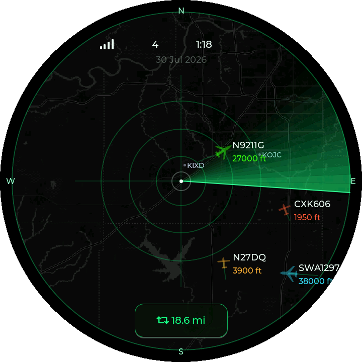
</p>
<p align="center"><sub>18 aircraft in range over Kansas City — Delta, SkyWest, Mesa, Southwest and a NetJets bizjet, each drawn by type, coloured by altitude, over a CARTO basemap with four airports labelled.</sub></p>

## Screens

Every image on this page is the **real framebuffer from my device**, pulled over WiFi with
`python tools/grab_screens.py` — not photographs and not a simulator.

| Radar | Detail card | Contacts |
|:---:|:---:|:---:|
|  | 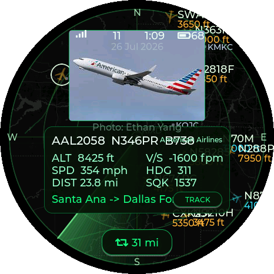 | 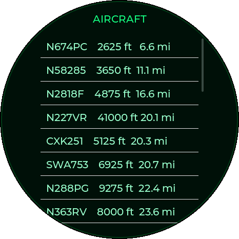 |
| Aircraft drawn by type, altitude-coloured, airports labelled by ident | Tap a contact: callsign, registration, type, altitude, speed, heading, squawk — plus airline, route and a photo of the actual airframe | Nearest-first contact list |

| Tracked flight | Stats | Clock |
|:---:|:---:|:---:|
| 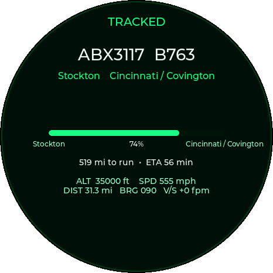 | 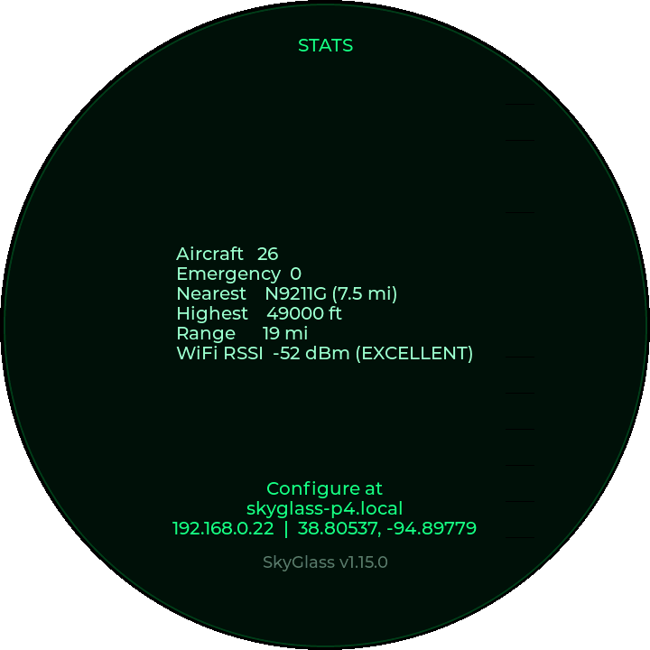 | 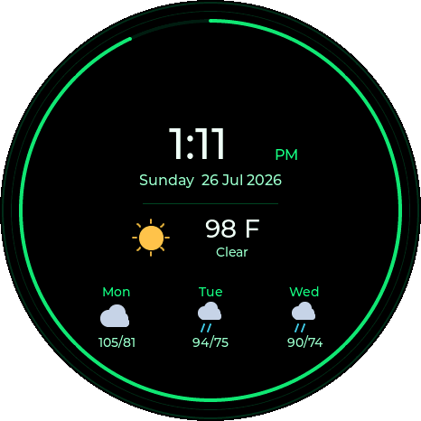 |
| Follow one flight: progress along the great circle, distance to run and ETA | Traffic summary and how to reach the config page | Watch face with a seconds arc and current conditions |

| Precipitation | Satellite | Forecast |
|:---:|:---:|:---:|
| 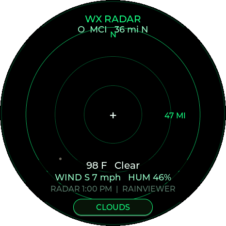 | 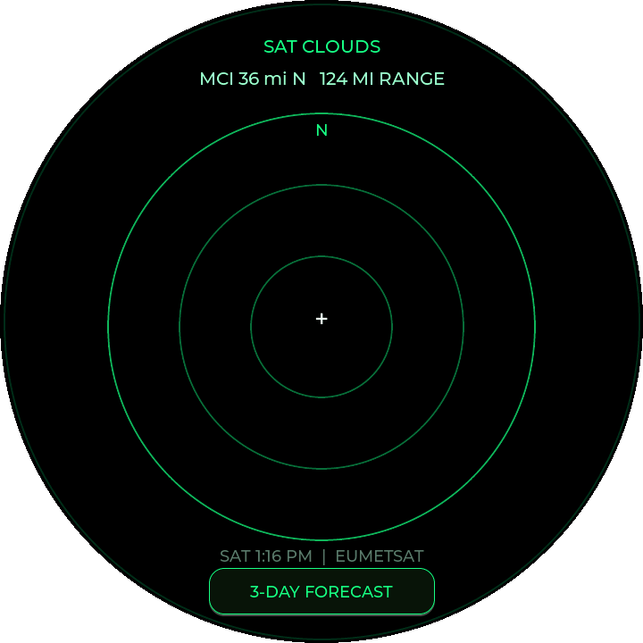 | 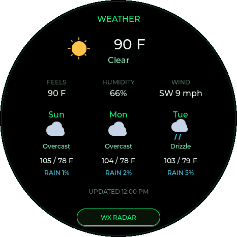 |
| RainViewer echoes with aviation-style overlays | EUMETSAT cloud-type imagery | Three days with vector weather icons |

| Boot splash | About |
|:---:|:---:|
| 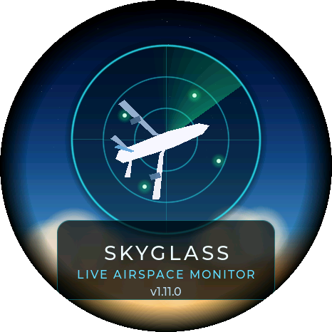 | 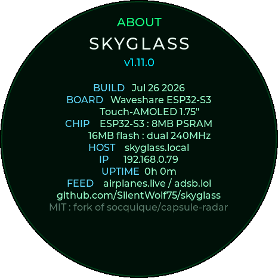 |
| Painted per-pixel into a PSRAM canvas: gradient sky, stars, lit clouds, a live-looking scope and a banking airliner | The last screen: build date, board, chip, hostname, IP, uptime, feed and where the source lives |

| Continental fire map |
|:---:|
| 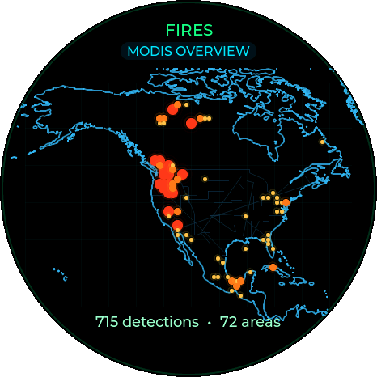 |
| Active fires across the US, Canada and Mexico — 715 detections binned into 72 clusters, sized and coloured by fire radiative power. **Tap any cluster to zoom in**, which re-queries the higher-resolution VIIRS feed instead of the MODIS overview. |

### Themes

Long-press the screen to cycle, or pick one on the config page. All four captured on the device:

| Phosphor | Orb | Amber CRT | Military |
|:--:|:--:|:--:|:--:|
| 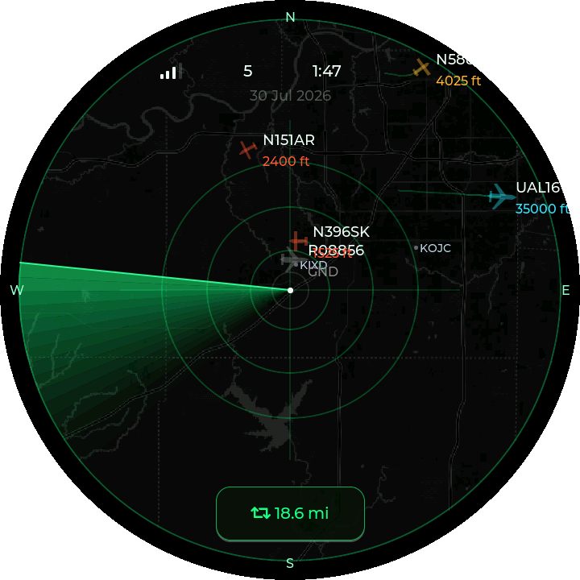 | 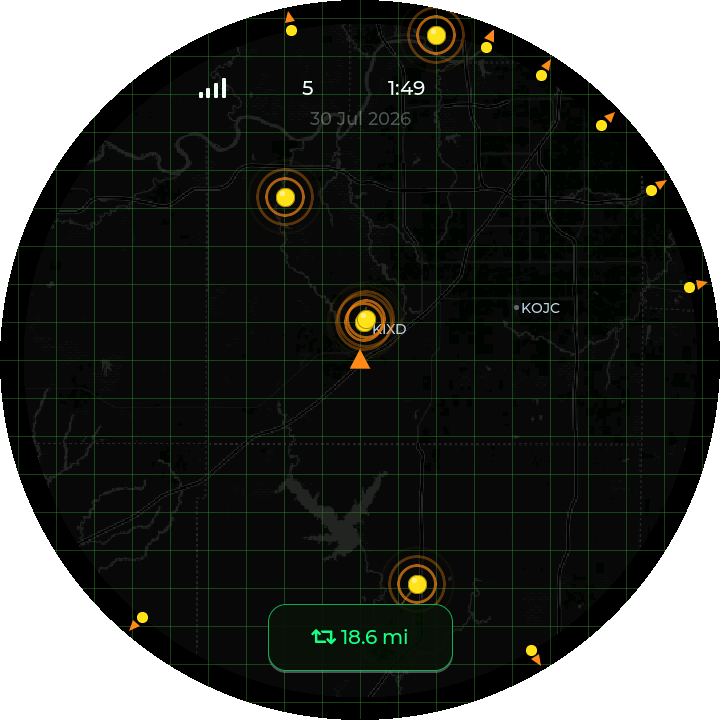 | 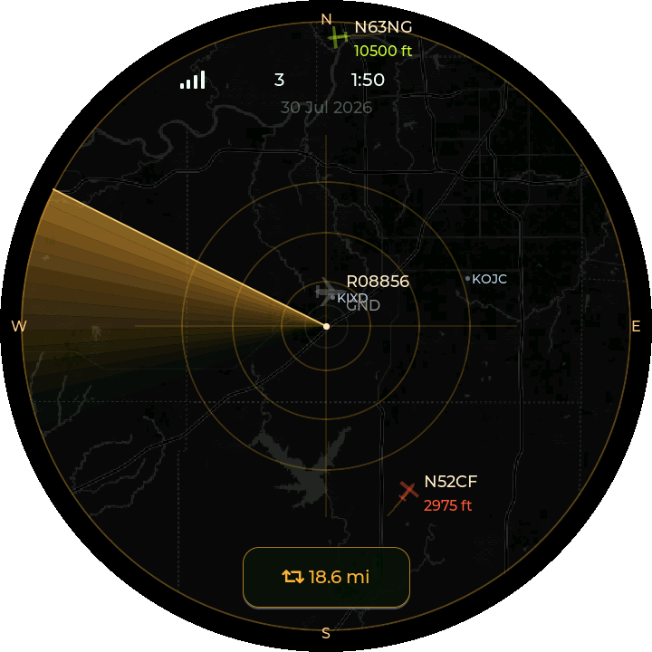 | 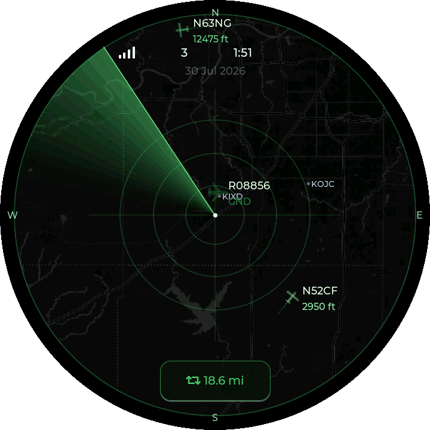 |

## Features

### Traffic
- **Live ADS-B** from [airplanes.live](https://airplanes.live) (free, non-commercial), falling
  back to [adsb.lol](https://api.adsb.lol). Polled every couple of seconds through a
  memory-safe streaming parser with a hard aircraft cap. An empty sky is normal, so the
  fallback backs off rather than doubling the request rate against both feeds all night.
- **Aircraft icons by type**: the ICAO type code picks a silhouette — swept-wing jets in three
  sizes, straight-wing props, helicopters with a rotor disc, fighters, gliders — each rotated
  by track. Falls back to a generic glyph for unknown types, and can be switched off.
- **Detail card on tap**: callsign, registration, type, altitude, vertical speed, ground speed,
  distance, bearing, squawk, **airline name**, **origin → destination** from adsbdb, and a
  **photo of the actual airframe** from planespotters (cached in NVS). Airliners and bizjets are
  usually covered; light GA aircraft often aren't in the photo index.
- **Tracked flight**: press **TRACK** on any card to follow it — progress along the great
  circle, distance remaining and ETA from ground speed. A tracked contact is pinned so the
  on-screen cap never drops it as it flies away.
- **Military highlighting**: contacts flagged military in the feed get corner brackets.
- **Filters**: minimum altitude, hide ground traffic, military-only, and up to **120** aircraft
  on the scope.
- **Marine traffic** (optional, free [aisstream.io](https://aisstream.io) key): switch the scope
  from aircraft to AIS vessels — cyan hulls oriented by course with ship names; tap for MMSI,
  speed over ground, course, distance and bearing. Deliberately one or the other, not an
  overlay: ships and aircraft live at completely different scales.

### Maps & environment
- **Map background**: dark or light [CARTO](https://carto.com/attribution/) basemap tiles under
  the scope, resampled through the radar's own projection so roads and coastlines line up with
  the range rings at every zoom. Tiles download one at a time so the live feed never stalls, and
  a **visibility slider** (0–100%) fades the basemap live.
- **Weather**: RainViewer precipitation radar, EUMETSAT cloud imagery, and a three-day
  Open-Meteo forecast with vector icons. Range rings honour your distance unit.
- **Wildfire markers** (optional, free [NASA FIRMS](https://firms.modaps.eosdis.nasa.gov/api/map_key/) key):
  active fire detections on the scope, sized and coloured by radiative power.
- **Continental fire map** (same key): a whole extra screen for North America with coastlines
  and state borders, tap-to-zoom, and a switch to VIIRS resolution when zoomed. Refreshes every
  15 minutes.

### The device itself
- **Touch**: tap to inspect, **double-tap** to cycle range, **pinch** to zoom continuously,
  long-press to change theme. Swipe between **Radar / List / Stats / Weather / Tracked / Clock /
  Fires / About**. Ranges run from 1 mi to 100 km.
- **Alert sounds** (ES8311 speaker): a soft cue for a new aircraft in range, an urgent one for
  emergency or military. Pick **Chime, Sonar ping, Marimba, Aircraft warning** or **Beep** per
  cue independently — or **upload your own WAV** from the config page. It's converted on the
  device (stereo downmixed, 8–48 kHz resampled to 16 kHz, normalised) and stored in flash, so it
  survives reboots without rebuilding.
- **Quiet hours**: a window that dims, blanks, or forces the clock view; a touch wakes it for
  15 seconds.
- **Clock**: 12- or 24-hour, applied to the HUD, the watch face and weather timestamps. Backed by
  a **PCF85063 RTC** so the time is right before WiFi, re-synced from NTP once online.
- **Battery aware** (AXP2101): charge level in the HUD, low warning, and a slower poll rate on
  battery.
- **Smart brightness**: idle auto-dim, plus **face-down sleep** via the QMI8658 IMU — flip it
  over to blank the screen.
- **GPS auto-location** (optional **-G** board variant): the onboard LC76G sets the centre point
  itself, with a satellite status icon while acquiring.
- **Self-update over WiFi**: checks this repo's GitHub Pages build for a newer version and
  installs it — no cable, no toolchain. On demand from the config page, or leave the 6-hourly
  auto-check on. Writes to the inactive OTA slot, so a failed download can't brick a working
  install.

## Hardware

Waveshare **ESP32-S3-Touch-AMOLED-1.75**: ESP32-S3R8 (8 MB PSRAM, 16 MB flash), **CO5300**
AMOLED over QSPI, **CST9217** touch, **QMI8658** IMU, **PCF85063** RTC, **AXP2101** PMIC,
**ES8311** audio + speaker, microSD. All pins live in [`src/config.h`](src/config.h), taken from
the board definition rather than guessed.

## Flash from your browser (no toolchain)

1. Open the **[web flasher](https://silentwolf75.github.io/skyglass/)** in Chrome or Edge.
2. Plug the board in with a USB-C **data** cable and click **Install**.

> Leave **Erase device** unticked to keep your WiFi credentials, settings and uploaded alert
> sound. Tick it for a clean install or to recover a confused device.

The flasher writes bootloader, partition table, `boot_app0` and application to their own
offsets. It deliberately does *not* write one merged image starting at `0x0` — that image's
`0xFF` padding covers the NVS region at `0x9000`, which silently wiped settings on every web
flash regardless of the erase checkbox.

## Build & flash (PlatformIO)

```bash
pio run -e esp32-s3-amoled-175 -t upload
```

Serial log:

```bash
pio device monitor -b 115200
```

On first flash you may need to hold **BOOT** then tap **RESET**. On first boot, connect a phone
to the **`SkyGlass-Setup`** WiFi and enter your home network — aircraft appear within
seconds.

## Update over WiFi (no cable)

Easiest is the config page: **Check for update**, then **Install**. To push a local build
instead:

```bash
curl -X POST -F "f=@.pio/build/esp32-s3-amoled-175/firmware.bin" http://skyglass.local/update
```

Or upload `firmware.bin` by hand at `http://skyglass.local/update`. Use the **app-only**
image here, never the merged one.

## Configuration

Browse to `http://skyglass.local/` (or the device IP) on the same WiFi: centre point with a
map picker, display range, theme, time zone, brightness, map background and visibility, aircraft
filters, marine and wildfire layers and their API keys, quiet hours, sounds, firmware update and
WiFi reset. Settings persist in NVS.

### Diagnostics

`http://skyglass.local/diag` returns a health snapshot as JSON — free heap, minimum heap
since boot, largest contiguous internal block, free PSRAM, aircraft counts, and why the last
photo fetch succeeded or failed. It exists so those numbers can be read over WiFi instead of
only from a serial cable:

```json
{"fw":"1.10.39","uptime_s":1520,"heap":110616,"heap_min":50968,"heap_largest":32756,
 "psram":5108176,"aircraft":26,"max_on_screen":120,"feed_cap":120,"fires":3,"photo":"ok"}
```

## Screenshots

`tools/grab_screens.py` walks every view and writes one PNG per screen, masking the corners
transparent to match the round panel. Pure stdlib — no Pillow, no ffmpeg:

```bash
python tools/grab_screens.py skyglass.local docs/img/screens
```

It drives the firmware's own `/view` and `/shot.bmp` endpoints, so it can select a contact,
track a flight and switch screens without anyone standing at the device.

## Desktop simulator

The UI is portable LVGL and runs on a computer via SDL2 — useful for iterating without hardware:

```bash
pio run -e native -t exec
```

Mouse = touch · `T` = switch theme · close the window to quit.

## Repo layout

```
src/
  config.h           pins + tunables
  main.cpp           tasks, WiFi/NTP, web config + diagnostics, brightness/IMU glue
  display.*          CO5300 (Arduino_GFX) + LVGL bring-up
  radar_view.*       the radar scope, aircraft, themes
  aircraft_types.*   ICAO type designator -> drawing silhouette
  ui.*               views (radar/list/stats/weather/tracked/clock/fires), cards, HUD
  touch_cst9217.*    capacitive touch (single touch + 2-point pinch)
  adsb_client.*      airplanes.live / adsb.lol fetch + parse
  photo.* photo_client.*        airframe photos (planespotters)
  route*.* route.*              origin -> destination lookup (adsbdb)
  airline.*                     operator name (offline table)
  map_bg.* map_client.*         CARTO basemap: tile fetch, stitch, reproject
  firemap.* firemap_client.*    continental fire map
  wildfire.* wildfire_client.*  NASA FIRMS on-scope markers
  vessel.* ais_client.*         AIS marine traffic (aisstream.io WebSocket)
  coastline.*        vector coastlines and borders for the fire map
  updater.*          self-update from GitHub Pages
  imu_qmi8658.*      accelerometer (face-down sleep)
  battery.*          AXP2101 battery gauge
  rtc_pcf85063.*     PCF85063 real-time clock
  sim_main.cpp       native SDL simulator (not flashed)
include/lv_conf.h    LVGL config (v8)
web/flash/           browser web-flasher (ESP Web Tools)
tools/               grab_screens.py, gen_alert_sound.py, gen_airports.py
scripts/             build_webflasher.sh
docs/                hardware / data-source / architecture / feature notes
```

## Credits

This firmware is a fork of **[socquique/capsule-radar](https://github.com/socquique/capsule-radar)**
by Quique Tortosa, which is the original project and the source of the core scope, themes and
device bring-up. It remains MIT licensed — see [`LICENSE`](LICENSE), which keeps his copyright
notice. Several features here were adapted from
**[yashmulgaonkar/FlightScnr_Pi](https://github.com/yashmulgaonkar/FlightScnr_Pi)**.

Related work worth knowing about:

- **[SkyGlass for the Waveshare ESP32-S3-Touch-LCD-2.1](https://github.com/alexzogh/skyglass/tree/port/esp32-s3-lcd-21)**
  by **@alexzogh** — a port to the 2.1" round LCD (ST7701).
- A 3D-printed enclosure for this board is published by the original author on
  **[MakerWorld](https://makerworld.com/en/models/2907695-skyglass-live-flight-radar-desk-gadget)**.

## Data & license

**Firmware / code: [MIT](LICENSE)** — fork and build on it freely, keeping the notice.

Aircraft data: **airplanes.live** and **adsb.lol** (free, **non-commercial / educational** — be
polite with request cadence). Routes: **adsbdb.com**. Airframe photos: **planespotters.net**,
proxied through **images.weserv.nl** for baseline-JPEG re-encoding; each photo is credited to its
photographer on the card and remains the property of its owner. Basemap tiles: **CARTO** /
**OpenStreetMap** contributors. Weather: **Open-Meteo**, **RainViewer**, **EUMETSAT**. Marine
AIS: **aisstream.io** (your own key). Active fires: **NASA FIRMS** (your own key).

Personal, hobby, non-commercial project.
